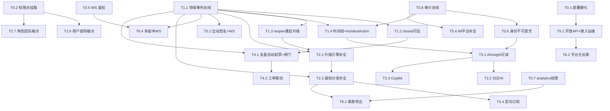

# Vigil 功能完整性与可用性迭代计划

> **本文定位**：这是 Vigil 面向「功能可用、生产可交付」的**执行视图**，把审计问题清单转成可排期、可转 issue 的迭代任务。
>
> **三份文档的关系**：
> - [`audit/journey-code-audit-2026-07-03.md`](./audit/journey-code-audit-2026-07-03.md) —— **问题清单**（90 条 S/B/C/M 源码核对结论），本文的原材料。
> - [`backlog.md`](./backlog.md) —— **已推迟项**（作战室明确不做；其余待规划项与任务重叠时在任务内注明）。
> - 本文 `roadmap-completeness.md` —— **执行视图**：把上述问题按用户旅程的功能闭环归并成里程碑与任务。
>
> **基线日期**：2026-07-04（核对基线代码 2026-07-03）。
> **性质声明**：本计划**只做规划，不含实现**。工作量为粗估，用于排期与转 issue，不代表已完成设计评审。
> **状态标注**：沿用 ✅ 已实现 / 🟡 部分 / 📋 未实现 / ❌ 不存在 / 🚧 暂不做。

---

## 阅读指引

- **归并原则**：按**功能闭环**（用户可感知的一个能力）归并，不按代码模块。一个任务可能横跨 S/B/C/M 四组审计。
- **纠偏类（C）甄别**：C 类是「文档已改对」，但其中描述**功能缺失**的（如 C3 无兜底、C5 Override 未实现、C15 AI 分诊无代码）仍需补代码，纳入任务；纯**语义澄清**型（已符合代码、无需改动）归入文末「文档已澄清，无需开发」清单。
- **正向确认（S17/S18）**：防护已在，列入「已具备」清单，不产生任务。
- **全覆盖**：每条审计都落到某任务或某清单，文末附 90 行对照表并自查。

---

## 里程碑总览

| 里程碑 | 主题 | 对应旅程 | 任务数 | 准入 | 退出 |
|--------|------|----------|--------|------|------|
| **M0** | 生产安全底线（阻断级） | A 部署 / 全局 | 8 | — | 无越权/旁路/冒充/验签/留痕缺口；生产默认安全 |
| **M1** | 主处置链路可用与状态一致 | C 处置核心 | 6 | M0 部分（领域事件总线） | closed 可达、reopen 重启升级、时间线写全、多端同步一致 |
| **M2** | 管理配置真正生效 | B 配置 | 8 | M1（领域事件） | 升级/通知/排班/路由配置项均参与运行时；配置关联端点齐备 |
| **M3** | AI 能力补全 | C AI Copilot | 4 | M1（时间线/事件） | AIInsight 可读持久化、分诊/处置 AI、反馈闭环 |
| **M4** | 复盘与协同闭环 | C 复盘 / E 订阅 | 4 | M1（closed/事件）、M3（AI 起草） | resolve 自动起草+闸门、sections 编辑、工单联动、定向订阅 |
| **M5** | 接入与集成补全 | A / F 集成 | 5 | M0、M1 | 开放 API、接入运维、出站/WS 增强、IM 平台补全 |
| **M6** | 报表/平台化/长尾 | D 保障 / F | 4 | M2、M5 | 报表导出/定时聚合、集成向导、凭据托管、多副本 WS |

**总计 6 个里程碑，39 个任务。**（M0–M6 顺序为建议主序，跨里程碑并行见文末依赖图。）

---

## 实现进度（截至 2026-07-04）

> 本节随实现推进更新，记录各任务落地状态与关键提交（基线：`main`）。计划正文的任务描述保持不变，作为设计依据。

### ✅ M0 生产安全底线 —— 全部完成

M0 的 8 个任务已全部闭环合入 `main`：生产默认配置的越权、鉴权旁路、身份冒充、验签绕过、操作不留痕缺口均已消除。每个任务经独立 worktree 实现 + 三门禁 + squash 合入 + `main` 全量复验。

| 任务 | 状态 | 关键提交 |
|------|:---:|----------|
| T0.1 生产部署硬化 | ✅ | `fd85fee`（APP_ENV/生产禁头回退/reset 仅 dev）+ `c85aafd`（/health schema 就绪探测、seed 失败退出、redis 密码注入修正） |
| T0.2 悬空权限点挂载 | ✅ | `83b0d17` |
| T0.3 用户禁用即时失效 | ✅ | `6cb288c` |
| T0.4 改密令牌吊销 + Web 改密页 | ✅ | `2675f39`（token_version 吊销 + 改密页 + 首登强制改密闭环） |
| T0.5 WS 端点鉴权 | ✅ | `6a4d43d`（?token= 握手鉴权，前后端闭合） |
| T0.6 身份不可冒充 | ✅ | `7f82559`（复盘起草权限）+ `9dac984`（时间线 actor 回填、复盘覆盖保护、AIInsight 改判防翻转+留痕，新增 `ai.insight.resolve` 权限点） |
| T0.7 analytics 权限 + 团队 scope | ✅ | `83b0d17`（权限点）+ `4e0ba13`（团队 scope 数据隔离、Unrouted 排除噪音） |
| T0.8 敏感操作审计总线 | ✅ | `f7fce5b`/`492bdaa`（审批闸门 + 并发锁）+ `650afbb`（IM 越权/用户禁用/Integration 变更审计、action 扩展、audit-logs 时间筛选） |

**附带完成**（审计外新发现）：`d98843a` + `8663dfd` —— checkAccess 短路失效越权修复 + 为 8 个 handler 补跨 team 隔离测试。

### 🟡 M1 主处置链路 —— 已启动

| 任务 | 状态 | 关键提交 |
|------|:---:|----------|
| T1.5 前端断链修复（json tag） | ✅ | `45c27f2`/`ce756f5`（analytics/Runbook 结构体补 json tag）+ `12529c3`（失败步骤保留结构化 Output） |

**下一步（M1 地基）**：**T1.1 领域事件总线扩展**（L，P0）—— 全局关节，解锁 closed 可达（T1.2）、reopen 重启升级（T1.3）、时间线+IncidentAction（T1.4）、升级/通知补全（M2）、AI 时间线（M3）、复盘自动起草（M4）、出站/WS 同步（M5）。

**已登记的既有技术债**（不阻塞里程碑，另行排期）：swag（OpenAPI 生成器）在本仓库损坏，`internal/server/gen/*` spec 相对 handler 注解已陈旧，当前靠手工补丁增量维护 —— 需修复生成环境并重生成整份 spec。

### 🟡 M2 管理配置真正生效 —— 已启动

| 任务 | 状态 | 关键改动 |
|------|:---:|----------|
| T2.2 通知分发补全 | ✅ | 新增 `Notification` ent 实体（送达三态 + suppressed）；`rule.go` 规则评估（condition/channels 参与，B7/C12）；`notifier.go` 逐通道兜底降级链（主通道失败降级，C12）+ 全链失败兜底告警 org_admin（B22）；电话/短信入默认链、`User.phone` 可写（B8）；`GET /incidents/:id/notifications` 送达查询（M13）；模板同名自定义优先消除 Only 歧义（C20） |
| T2.3 排班补全 | ✅ | 新增 `Override` ent 实体（schedule 边 / user 顶替人 / created_by / start_time / end_time / reason）；`POST\|GET\|DELETE /schedules/:id/overrides` 端点（`schedule.override` 权限，oncall 换己班 / 换他人叠加 `schedule.update`，seed 给 team_admin override）；引擎解算 Override 层（最高优先级、override=true，C5/M8）；空班检测记 metric+Warn+告警 team_admin（无 team 归属兜底 org_admin，C4）；引擎按 `Schedule.type` 差异化解算 + 跳过 `status=disabled` 用户（B21）；`PATCH /schedules/:id` layers 事务重建 Rotation（B21）；oncall 响应结构 `{schedule_id,schedule_name,layers[]}` 加测试锁定（C7） |
| T2.4 路由与抑制增强 | ✅ | `triage/engine.go` `route()` 增强：slug 直达（向后兼容）→ `Service.labels` 子集匹配（`Event.labels ⊇ Service.labels` + glob `path.Match` + 多命中按匹配标签数具体度优先，确定性裁决）→ Integration 默认 service 兜底（C2/B14）；`suppression.go` 过期规则跳过 + 多命中按 `match_labels` 具体度排序（B15）；`notification/handler.go` SuppressionRule `expires_at` 可设/清除并生效（B15，原 handler 忽略）；新增 `POST /events/:id/reroute` 未路由重路由端点（`triage/handler.go` + `Engine.Reroute`，权限 `service.route_override` 团队软隔离，seed 给 team_admin，M6）；去重/聚合窗口抽为可配 `Triage.{Dedup,Aggregate}Window`（env `VIGIL_TRIAGE_*`，默认 5m，C9） |
| T2.5 配置关联端点 | ✅ | `service/handler.go` create/update 请求体收 `schedule_ids`/`runbook_ids`（create 全量设置；update 全量替换：nil 不改 / `[]` 清空 / `[x,y]` 替换，`dedupIDs` 去重防唯一约束冲突），`create`/`get`/`update` 响应经 `withAssociations` 回带关联 id（B13/M14）；设置关联须 `service.update`（仅 view 只读角色不得改关联）；escalation_policy 继承已具备（triage `bindPolicyAndPublish` 建单时 `svc.QueryEscalationPolicy()` 绑定），schedule/runbook 为 Service 边、本轮补齐**配置入口**（继承为运行时按边查询，无需拷字段）；`postmortem/handler.go` ActionItem `POST`/`PATCH` 请求体收 `due_date`（RFC3339，schema 有 `due_date` 字段原不收，M14）；OpenAPI spec + 前端 types 重生成（纯增量 +423 行，无 churn） |
| T2.6 用户与密码管理端点 | ✅ | `auth/handler_user_team.go` 新增 `POST /users` 建用户（username/email/name/timezone/初始密码，权限 `user.create`，`must_change_password=true` 首登强制改密，重复 username/email 归一 409）+ `POST /users/:id/reset-password` 管理员重置他人密码（权限 `user.update`，重置后强制改密 + `AddTokenVersion(1)` 复用 T0.4 吊销机制使被重置用户旧 token 立即失效，M1）；建用户/重置密码落审计（新增 `user.create`/`user.reset_password` action）；`User.phone` 可写已在 T2.2 具备（B8）；wire.go 登记两条敏感路由权限点 |
| T2.7 角色编辑与团队成员管理端点 | ✅ | `auth/handler.go` 新增 `PATCH /roles/:id` 编辑角色权限集/名称（权限 `role.update`，内置角色 builtin 拒改返 403，权限点逐个校验合法性，重名归一 409，M2）；`auth/handler_user_team.go` 新增 `GET|POST /teams/:id/members` + `DELETE /teams/:id/members/:uid` 成员增删（权限 `team.member.manage` 悬空点落地，S15/M3；handler 内以目标团队 id 作 scope 二次校验实现跨团队拒——`parseTeamScope` 读 `team_id` 不读 `:id`，故补 handler 级软隔离）；移除成员**不联动删 team-scope RoleBinding**（归属与授权正交，撤权走显式 `DELETE /role-bindings/:id`，注释详述）；`createTeamReq`/`updateTeamReq` 加 `parent_team_id`；新增 `role.update`/`team.member.add`/`team.member.remove` action；wire.go 登记路由权限点 + 给 TeamHandler 注入 authz/audit；OpenAPI spec + 前端 types 重生成 |
| T2.8 主资源 team_id 归属修复 | ✅ | `escalation/handler_policy.go` 与 `runbook/handler.go` 的 `createReq` 补 `team_id`（B26），创建时设 team 归属；新增 `checkCreateTeam`：非 org 级用户经 `VisibleTeamIDs` 校验只能给可管 team 建，跨团队建返 403 且不落库（防越权占位）；顺带修 escalation create 未传 `levels` 时因必填 JSON 字段缺失返 500 的隐患（无 team schema 改动，团队边本已具备）；两包 isolation 测试各加「建己团队 201 且落归属 / 建他团队 403 且不落库」用例；OpenAPI spec（json/yaml/docs.go）+ 前端 types 重生成 |

### 🟡 M3 AI 能力补全 —— 已启动

| 任务 | 状态 | 关键改动 |
|------|:---:|----------|
| T3.3 Copilot 处置推荐 / draft_summary | ✅ | AIInsight schema 新增 `runbook_suggestion` type（`go generate ./ent/...`）；新增 `internal/ai/copilot.go` `CopilotEngine`（照 T3.2 triage_ai.go 同款：human-in-the-loop + evidence 强制 + 置信度门槛 0.6 + LLM 降级不产出）。**runbook_suggestion**：基于 Incident 内容 + 当前 Service 关联 Runbook 候选 + 相似历史事件的 `runbook_executed` 时间线痕迹，LLM 推荐用哪个 Runbook，产出带 evidence（被推荐 Runbook + 历史处置痕迹）的建议；推荐 id 必须在候选集内（防幻觉）。**★ 安全红线**：`content` 只含 `recommended_runbook_id`/`reason`（供高亮呈现），不含任何执行指令；accept 走 `diagnose.go applyInsight` —— runbook_suggestion 无实际应用动作，终态 `accepted`（非 applied），绝不调用 runbook 引擎；执行仍走 Runbook 两档安全（写操作 `require_approval` 未审批被阻断）。**draft_summary**（stage=copilot）：LLM 草拟 Incident 处理中实时状态摘要（供快速了解/交接），以时间线为 evidence；与 `postmortem_draft`（复盘全文，stage=postmortem，不在本任务）明确区分。新增 `POST /incidents/:id/ai-copilot` 手动触发端点（LLM 不可用返 200 disabled）；wire.go 装配 `CopilotEngine`（共享 GLM provider + 时间线记录器 + 复用诊断链相似检索）。测试锁定：推荐带 evidence、**accept 不绕过 require_approval（含独立跑写步骤验证审批闸门仍生效 + accept 后无 runbook_executed 时间线）**、幻觉 id 过滤、低置信度/无候选不产、draft_summary 生成、与 postmortem_draft 区分、LLM 降级不产不落库。OpenAPI spec + 前端 types 重生成（纯增量 +188/+72 行） |
| T3.4 反馈闭环与知识检索修复 | ✅ | **知识检索修复（B18，`internal/ai/diagnose.go` FindSimilarPostmortems）**：① 相似复盘检索范围从硬编码 `status='published'` 改为 `IN(published,archived)`——归档复盘仍是有效知识（`knowledgePostmortemStatuses`）；② 补 **LIKE 文本降级**（`findSimilarPostmortemsText`，与 FindSimilar 同款）：pgvector/Embed 不可用时按关联 incident title/summary 关键词匹配 published/archived 复盘（排除自身与 draft/in_review），不再静默返回 `[]`；③ **embedding 补算**（懒计算）：发布时 embedding 计算失败原为完全静默，现 `postmortem/engine.go` 记 Warn，且检索路径 `backfillPostmortemEmbeddings` 按需为 published/archived 缺 embedding 的复盘补算回写（单次至多 10 条，多次渐进，检索库最终一致）；provider/runSQL 不可用时跳过补算（此时走 LIKE 降级，补算无意义）。**AI 反馈闭环**：`internal/analytics` 新增 `AIFeedbackMetrics`（accept/reject/pending 计数 + 采纳率，分母为已改判数不含 pending；ByType 按建议类型细分）+ `GET /analytics/ai-feedback` 端点（`analytics.view` 权限 + team scope 隔离，经 AIInsight→incident→team）。**噪声学习实现边界（不夸大）**：当前实现是「记录 + 可查」——reject 的建议按类型聚合成可观测指标，供运营判断 AI 质量、人工调优 prompt/抑制规则；**不自动改变后续 AI 行为**（不回训、不自动生成 suppression 规则），已在方法注释与本行明确边界。测试锁定：archived 经 LIKE 命中、pgvector 不可用 LIKE 非空、排除自身/draft、embedding 缺失被懒补算、无 provider 不补算、反馈计数/采纳率口径、reject 按类型可查、反馈 team scope 隔离。OpenAPI spec + 前端 types 重生成（纯增量 +271 行，无 churn） |

> **附注**：`docs generate` 环境实测可用——本轮 `go generate ./cmd/vigil/...` 正常重生成整份 spec（swag `--v3.1` + swagfix），diff 为纯增量。M1 进度节记的「swag 损坏」技术债或已随环境修复，待后续任务复核。

---

## M0 生产安全底线（阻断级，最高优先）

> **目标**：消除任何登录/未登录用户可利用的越权、鉴权旁路、身份冒充、验签绕过与操作不留痕缺口，使生产默认配置即安全。
> **准入判据**：无（可立即启动，多数任务互相独立可并行）。
> **退出判据**：S1–S16 全部关闭；生产 Helm 默认不暴露 reset/头回退；WS/analytics/复盘/时间线均有权限与身份校验；敏感操作全链路留痕。
> **建议顺序**：T0.1（生产部署硬化）与 T0.2（悬空权限点挂载）优先并行；其余任务独立，可并行推进；T0.8（审计总线）为 M1/M2 多个任务的前置，宜早启动。

| 任务号 | 标题 | 覆盖审计 | 能力域 / 旅程 | 工作量 | 优先级 |
|--------|------|----------|---------------|--------|--------|
| T0.1 | 生产部署安全硬化 | S1, B27, C22, C26 | H1 / A.3 | M | P0 |
| T0.2 | 悬空权限点挂载与敏感路由授权 | S2, S15 | 13 / B.1.1、附录A | M | P0 |
| T0.3 | 用户禁用即时失效（token/APIKey） | S3, S4 | 13 / B.14、F.2 | M | P0 |
| T0.4 | 改密令牌吊销机制 | S5, C23 | 13 / A.4 | M | P0 |
| T0.5 | WS 端点鉴权 | S6 | 14 / C.3.6、F.4 | S | P0 |
| T0.6 | 身份不可冒充：时间线/复盘/AI 服务端回填与校验 | S7, S8, S11 | 10·12·11 / C.6、C.8、C.4.4 | M | P0 |
| T0.7 | analytics 权限点与团队 scope | S14, C25 | 15 / B.11 | M | P0 |
| T0.8 | 敏感操作全链路审计留痕（审计写入总线） | S9, S10, C21 | 13 / C.3.2、C.5.3、B.12 | M | P0 |

### T0.1 生产部署安全硬化
- **目标**：让 Helm/K8s 默认部署即为 production 安全态，杜绝 reset 无鉴权清库与头回退鉴权旁路。
- **覆盖审计**：S1、B27、C22、C26。
- **能力域 / 旅程**：H1 部署 / A.3。
- **关键改动点**：`deploy/helm/templates/deployment.yaml`（补 `VIGIL_APP_ENV=production` env）；补 migrate Job 或 initContainer；`server/testreset.go`（reset 端点仅 development 且显式开关）；`/health` 增加 migrate/schema 就绪探测（`server.go`、`wire.go:88-108` seed 失败退出）；补 ingress 模板与 `redis.password` 渲染修正（`Chart.yaml`/values）。
- **验收标准**：① 默认 `helm install` 后 `VIGIL_APP_ENV=production`，`/api/v1/__test__/reset` 与 `X-Vigil-User-ID` 头回退均不可用；② 未 migrate 实例 `/health` 返回非健康；③ seed 失败进程退出而非 Warn 续跑；④ ingress 模板可渲染。
- **依赖**：无。
- **工作量**：M。**优先级**：P0。

### T0.2 悬空权限点挂载与敏感路由授权
- **目标**：为 `GET/PATCH /users`、`GET /roles`、`GET /role-bindings` 等敏感路由登记并强制权限点，消除「任何登录用户可禁用/改他人」。
- **覆盖审计**：S2、S15。
- **能力域 / 旅程**：13 管理治理 / B.1.1、附录 A。
- **关键改动点**：`internal/auth/wire.go` `registerSensitiveRoutePerms`；`internal/auth/permission.go`（核对 `user.update`/`user.disable`/`event.view_unrouted`/`incident.create`/`incident.reassign`/`postmortem.create`/`team.member.manage`/`admin.global_integration`/`schedule.override` 悬空点：能挂的挂上，功能未做的在对应 M2–M5 任务实现时挂）。
- **验收标准**：① 无 `user.update`/`user.disable` 权限者调 `PATCH /users/:id` 返 403；② `GET /roles`、`GET /role-bindings` 需对应查看权限；③ 权限点清单与路由全集对账无「已定义未挂且端点存在」项。
- **依赖**：无。
- **工作量**：M。**优先级**：P0。

### T0.3 用户禁用即时失效（token / APIKey）
- **目标**：禁用用户的存量 refresh token 与 API Key 立即失效，堵住 30 天 token 与硬删吊销的窗口。
- **覆盖审计**：S3、S4。
- **能力域 / 旅程**：13 / B.14、F.2。
- **关键改动点**：`internal/auth/handler_auth.go` refresh 时查 `User.status`；`internal/auth/apikey.go` Verify 关联查所属 User.status；`internal/auth/authz.go`。
- **验收标准**：① 禁用后 refresh 换 access 返 401/403；② 禁用用户的 API Key 调用返 401；③ 无需逐个硬删 Key。
- **依赖**：无。
- **工作量**：M。**优先级**：P0。

### T0.4 改密令牌吊销机制
- **目标**：改密后旧 access/refresh token 立即失效；补齐 Web 改密页使首登改密可走。
- **覆盖审计**：S5、C23。
- **能力域 / 旅程**：13 / A.4、A.6。
- **关键改动点**：`internal/auth/jwt.go`（引入 token 版本号/`password_changed_at` 校验或黑名单）；`web/src/`（新增改密页面，非仅 login.tsx）。
- **验收标准**：① 改密后旧 token 请求返 401；② Web 有独立改密入口，首登强制改密闭环可走。
- **依赖**：无。
- **工作量**：M。**优先级**：P0。

### T0.5 WS 端点鉴权
- **目标**：`GET /ws/incidents/:id` 挂鉴权，仅有 `incident.view` 者可订阅。
- **覆盖审计**：S6。
- **能力域 / 旅程**：14 / C.3.6、F.4。
- **关键改动点**：`internal/auth/wire.go:237`（从 public 组移出）；`internal/ws/handler.go`（握手校验 token/session 与资源权限）。
- **验收标准**：① 未鉴权连接被拒；② 无 `incident.view` 者订阅被拒；③ 已有推送功能不回归。
- **依赖**：无。
- **工作量**：S。**优先级**：P0。

### T0.6 身份不可冒充：时间线/复盘/AI 服务端回填与校验
- **目标**：消除请求体自报身份的冒充路径，并为复盘起草/AI 改判补权限与状态前置校验。
- **覆盖审计**：S7、S8、S11。
- **能力域 / 旅程**：10·12·11 / C.6、C.8、E.5、C.4.4。
- **关键改动点**：`internal/timeline/handler.go` add（actor/source 服务端从登录态回填，忽略请求体自报；只读 subscriber 备注策略明确）；`internal/postmortem/handler.go`/`engine.go:101-115`（`postmortem.create` 权限校验、对已存在/published 复盘拒绝直接覆盖）；`internal/ai/diagnose.go` ResolveInsight（accept/reject 需操作权限而非仅 `incident.view`、加前置状态校验防反复改判、写 resolver 留痕）。
- **验收标准**：① 时间线备注 actor/source 恒为服务端登录态；② 无 create 权限者起草复盘返 403；③ 对 published 复盘起草不覆盖 sections；④ subscriber 无法 accept/reject AIInsight，且同一 insight 不可反复改判。
- **依赖**：T0.8（留痕落审计可复用审计总线）。
- **工作量**：M。**优先级**：P0。

### T0.7 analytics 权限点与团队 scope
- **目标**：6 个 analytics 端点加权限点与团队 scope，避免任意登录用户见全组织指标；顺带修正 Unrouted 口径偏大。
- **覆盖审计**：S14、C25。
- **能力域 / 旅程**：15 / B.11。
- **关键改动点**：`internal/auth/wire.go:318`（改直接 Register 为带权限点）；`internal/analytics/engine.go`（查询加团队 scope；Unrouted 计数排除被标噪 Event，即 `Not(HasService())` 收敛）。
- **验收标准**：① 无 analytics 权限者返 403；② 团队用户仅见本团队 scope 指标；③ Unrouted 计数不含 is_noise Event。
- **依赖**：无。
- **工作量**：M。**优先级**：P0。

### T0.8 敏感操作全链路审计留痕（审计写入总线）
- **目标**：建立统一审计写入能力，覆盖 IM 越权/denied、Runbook 执行人、配置变更/用户禁用等，扩展 AuditLog action 集与查询参数。
- **覆盖审计**：S9、S10、C21、C14（approved 留痕/并发保护面）。
- **能力域 / 旅程**：13 / C.3.2、C.5.3、B.12。
- **关键改动点**：`internal/im/handler.go`（注入 AuditRecorder，denied 落审计）；`internal/runbook/engine.go`（执行人 actor、approved 值、HTTP 层审计；补并发保护防连点重复执行）；`internal/timeline/recorder.go` RecordRunbook 带 actor；扩展 AuditLog action 枚举（超出现 7 种）；`internal/auth/handler_audit.go`（`GET /audit-logs` 增 from/to 时间参数）。
- **验收标准**：① IM 越权拒绝落审计；② Runbook 执行记录含 who/approved；③ 配置变更/用户禁用落审计；④ audit-logs 支持时间筛选；⑤ Runbook execute 并发连点不重复执行写操作。
- **依赖**：无（本任务即「领域审计总线」，是 T0.6 及 M1/M2 多任务的前置）。
- **工作量**：M。**优先级**：P0。

---

## M1 主处置链路可用与状态一致（旅程 C 核心闭环）

> **目标**：让 Incident 处置主链路端到端可用、状态在 Web/IM/WS/webhook 四端一致，时间线全程留痕，reopen 真正重启升级。
> **准入判据**：M0 的 T0.8（审计总线）已就绪。
> **退出判据**：closed 终态可达、reopen 重启升级链、领域事件驱动多端同步、12 类时间线全写入、IncidentAction 有写入、前端 KPI/执行结果不再断链、错误码归一。
> **建议顺序**：T1.1（领域事件总线扩展）为本里程碑地基，必须先做；T1.2/T1.3/T1.4 依赖它；T1.5（前端 json tag）与 T1.6（错误码）独立可并行早做（低成本高收益）。

| 任务号 | 标题 | 覆盖审计 | 能力域 / 旅程 | 工作量 | 优先级 |
|--------|------|----------|---------------|--------|--------|
| T1.1 | 领域事件总线扩展与多端同步 | B10, B11, B3, C24(出站补 created/自动升级) | 8·10·14 / C.3.6、F.3 | L | P0 |
| T1.2 | closed 终态可达 | B2 | 6·12 / C.2、C.6.1 | M | P0 |
| T1.3 | reopen 重启升级链 | B1 | 6 / C.2 | M | P0 |
| T1.4 | 时间线全程留痕 + IncidentAction 写入 | B4, B5, C30 | 10 / C.8、B.12 | L | P1 |
| T1.5 | 前端断链修复（analytics/Runbook json tag） | B19, B20 | 15·9 / B.11、C.5.2 | S | P1 |
| T1.6 | 处置错误码归一（404/400/409/500） | B25 | 8·6·11 / C.3.2、C.2、C.4 | S | P1 |

### T1.1 领域事件总线扩展与多端同步
- **目标**：让 Incident 全生命周期事件（含 created、自动升级、自动恢复）统一发布，驱动 WS 推送、IM 卡片刷新、出站 webhook 一致同步。
- **覆盖审计**：B10、B11、B3、C24（出站补 created/自动升级）。
- **能力域 / 旅程**：8 IM·10 时间线·14 集成 / C.3.6、F.3、C.2.1。
- **关键改动点**：`internal/*/wire.go:201-211`（扩展领域事件订阅集，`incident.created`/自动升级/自动恢复纳入发布）；`internal/triage/engine.go` handleResolved（自动恢复写时间线 + 发领域事件；按 service 取活跃单的解错与「已 acked 也被解决」问题修正）；`internal/ws/hub.go`（`timeline_added` 补广播点）；`internal/webhook/dispatcher.go`（出站补 created 与自动升级事件）。
- **验收标准**：① Incident created / 自动升级 / 自动恢复均推 WS 与出站 webhook；② `timeline_added` WS 有广播；③ 自动恢复写时间线且不误解其它活跃单、不解已 acked 单；④ IM 卡片随自动事件刷新。
- **依赖**：无（M1 地基）。
- **工作量**：L。**优先级**：P0。

### T1.2 closed 终态可达
- **目标**：提供 close 能力并让复盘发布回写状态，使 Incident 5 态机的 closed 终态真正可达。
- **覆盖审计**：B2。
- **能力域 / 旅程**：6·12 / C.2、C.6.1。
- **关键改动点**：新增 `POST /incidents/:id/close` 端点（`internal/incident/handler.go`）；复盘 publish 回写 `incident.status=closed`（`internal/postmortem/engine.go`）；补 `SetStatus(closed)` 调用路径与状态机校验。
- **验收标准**：① 可将 resolved incident 置 closed 并写时间线/发事件；② 复盘 publish 触发回写 closed；③ 非法转换返 400 `failed_precondition`。
- **依赖**：T1.1（close 发领域事件）。
- **工作量**：M。**优先级**：P0。

### T1.3 reopen 重启升级链
- **目标**：reopen 后重启升级链，重新发通知，而非静默停在 triggered。
- **覆盖审计**：B1。
- **能力域 / 旅程**：6 升级 / C.2。
- **关键改动点**：escalation 订阅集补 reopen/Escalated 后重启（`internal/*/wire.go:136-138/201-207`）；reopen 触发重排升级计时器（Asynq ProcessIn）。
- **验收标准**：① reopen 后升级链从首层重启并重发通知；② oncall/subscriber 的 reopen 权限按附录 A 校验；③ 与 ack 取消 pending 逻辑不冲突。
- **依赖**：T1.1。
- **工作量**：M。**优先级**：P0。

### T1.4 时间线全程留痕 + IncidentAction 写入
- **目标**：补齐 12 类时间线中零写入的 5 类，并落地 IncidentAction 写入/查询，使操作审计（via 统计）可行。
- **覆盖审计**：B4、B5、C30。
- **能力域 / 旅程**：10 / C.8、B.12。
- **关键改动点**：补 `incident_created`/`event_attached`/`status_changed`/`ai_insight`/`im_message` 写入点（各业务包）；`ent/schema/timeline_action.go` 对应的 IncidentAction 落写入与查询端点；`internal/incident/handler.go:200-276`（source 归因区分 web/api，不再硬编码 web）。
- **验收标准**：① 12 类时间线均有写入点；② IncidentAction 有 Create 与 list/统计；③ REST API 操作 source 归因为 api、Web 为 web、IM 为 im。
- **依赖**：T1.1（事件驱动写入）、T0.8（留痕与审计协同）。
- **工作量**：L。**优先级**：P1。

### T1.5 前端断链修复（analytics / Runbook json tag）
- **目标**：修复响应结构体缺 json tag 导致的前端断链，使 Dashboard KPI 与 Runbook 执行结果可见。
- **覆盖审计**：B19、B20。
- **能力域 / 旅程**：15·9 / B.11、C.5.2。
- **关键改动点**：`internal/analytics/engine.go`（响应结构体补 camelCase json tag）；`internal/runbook/engine.go`（ExecuteResult/StepResult 补 json tag；失败分支保留结构化 Output，不丢弃，强化 FIX-E）。
- **验收标准**：① Web Dashboard KPI 有数据；② Web 可见 Runbook 执行结果与失败输出；③ 前端无需改动即渲染（camelCase 对齐）。
- **依赖**：无（低成本高收益，可与 M0 并行早做）。
- **工作量**：S。**优先级**：P1。

### T1.6 处置错误码归一
- **目标**：统一非法状态转换、不存在 id、诊断类端点的 HTTP 错误码，Web/IM/API 语义一致。
- **覆盖审计**：B25。
- **能力域 / 旅程**：8·6·11 / C.3.2、C.2、C.4。
- **关键改动点**：`internal/im/handler.go`（非法状态转换由 500 归一为 400）；`internal/incident/handler.go`（四操作端点对不存在 id 返 404 而非 400 failed_precondition）；`internal/ai/`（diagnose/similar/resolve 对不存在 id 返 404 而非 500）。
- **验收标准**：① 非法状态转换 Web/IM 均 400；② 不存在 id 返 404；③ AI 端点不存在 id 返 404。
- **依赖**：无。
- **工作量**：S。**优先级**：P1。

---

## M2 管理配置真正生效（旅程 B 闭环）

> **目标**：让管理员在 Web 配置的升级、通知、排班、路由、抑制等规则真正参与运行时评估，并补齐配置关联所需端点。
> **准入判据**：M1 的 T1.1（领域事件总线）就绪（升级/通知补全依赖事件驱动）。
> **退出判据**：升级引擎补全、通知分发按规则评估并含兜底链/电话短信/送达记录、排班 Override 与空班检测、路由与抑制增强、配置关联端点齐备。
> **建议顺序**：T2.1（升级引擎补全）依赖 T1.1、T1.3；T2.2（通知分发补全）为大件，依赖 T2.1 的 target 解算；T2.3（排班）与 T2.4（路由/抑制）可并行；T2.5–T2.8（关联/CRUD 端点）互相独立可并行。

| 任务号 | 标题 | 覆盖审计 | 能力域 / 旅程 | 工作量 | 优先级 |
|--------|------|----------|---------------|--------|--------|
| T2.1 | 升级引擎补全 | B6, B9, C3, C6(确认层级语义) | 6 / B.6、剧本2 | L | P1 |
| T2.2 | 通知分发补全（条件/通道/兜底/电话短信/送达记录） | B7, B8, B22, C12, C20, M13(Notification实体/送达查询) | 7 / B.7、C.9 | XL | P1 |
| T2.3 | 排班补全：Override 换班 + 空班检测 + 禁用/类型解算 | C5, C4, B21, C7, M8 | 5 / B.5、B.5.1、B.5.2 | L | P1 |
| T2.4 | 路由与抑制增强 | C2, B14, B15, M6(重路由), C9(聚合窗) | 3·4 / B.3、B.7、C.1.1 | L | P2 |
| T2.5 | 配置关联端点：Service↔Schedule/Runbook | B13, M14 | 4·9 / B.3、C.5.0 | M | P2 |
| T2.6 | 用户与密码管理端点 | M1(建用户/重置密码), B8(User.phone 可写) | 13 / B.1.1、C.9 | M | P1 |
| T2.7 | 角色编辑与团队成员管理端点 | M2, M3, S15(team.member.manage) | 13 / B.2.1、B.2 | M | P2 |
| T2.8 | 主资源 team_id 归属修复 | B26 | 6·9 / B.6、B.8 | S | P2 |

### T2.1 升级引擎补全
- **目标**：让升级引擎按 `notify_channels` 发通知、解算 team 型 target 成员、手动 escalate 取消当前层 pending、critical unrouted 有兜底，并确认层级语义。
- **覆盖审计**：B6、B9、C3、C6（确认层级语义已符合代码，写入验收说明）。
- **能力域 / 旅程**：6 升级 / B.6、F.3、剧本 2。
- **关键改动点**：`internal/escalation/engine.go`（引用 `EscalationLevel.notify_channels`；`resolveTargets` 解算 team→成员，不再占位 UserID=0；手动 escalate 取消当前层 pending）；critical unrouted 兜底通知全员/admin（`internal/triage/engine.go` 与通知链协同）。
- **验收标准**：① 各层按 notify_channels 走对应通道；② team 型 target 邮件/电话对全体成员发；③ 手动 escalate 取消当前层 pending 任务；④ critical unrouted 触发兜底通知；⑤ 层级 repeat_times 语义（策略级，每层 repeat+1 次、间隔=该层 delay）文档化并有测试。
- **依赖**：T1.1、T1.3。
- **工作量**：L。**优先级**：P1。

### T2.2 通知分发补全
- **目标**：让 `NotificationRule.condition`/`channels` 参与评估分发，建立逐通道兜底降级链，接通电话/短信，落地 Notification 送达实体与查询。
- **覆盖审计**：B7、B8、B22、C12、C20、M13（Notification 实体/送达查询端点）。
- **能力域 / 旅程**：7 通知 / B.7、C.9。
- **关键改动点**：`internal/*/wire.go` buildNotifier 与 resolver（按 rule.condition/channels 评估，不再取首条 enabled 规则）；`internal/notification/notifier.go:80`（并联改为可配兜底降级链）；phone/sms 纳入链路（`channels_phone.go`）；`updateUserReq` 支持写 `User.phone`；**新增 `Notification` ent 实体**记录送达（quiet_hours 丢弃/全败落库可查、可补发）；`internal/notification/template.go`（同名模板歧义修正）。
- **验收标准**：① condition/channels 参与分发；② 逐通道降级链可配并生效；③ 电话/短信可触发且 User.phone 可写；④ 送达记录落库、可查、被静默/全败有记录与补发/告警；⑤ 同名模板不再歧义降级回内置。
- **依赖**：T2.1（target 解算）、T1.1。**含 backlog 项**：报表/送达查询端点（backlog「报表/审计导出端点」部分重叠）。
- **工作量**：XL（引入新 Notification 实体 + 通知链重构）。**优先级**：P1。

### T2.3 排班补全：Override 换班 + 空班检测 + 禁用/类型解算
- **目标**：新增 Override 换班（实体+端点+解算）、空班检测告警 team_admin、引擎读 Schedule.type 且不解算禁用用户，并明确 oncall 响应结构。
- **覆盖审计**：C5、C4、B21、C7、M8。
- **能力域 / 旅程**：5 排班 / B.5、B.5.1、B.5.2。
- **关键改动点**：**新增 Override ent 实体**与端点（`ent/schema/schedule.go`、`internal/schedule/`）；引擎解算 override（`override` 不再恒 false）；空层告警 team_admin（`schedule/engine.go:94-96` 不再静默 continue）；引擎读 `Schedule.type` 差异化、查 `User.status` 跳过禁用；Schedule PATCH 重建 Rotation（`schedule/handler.go`）；oncall 响应结构 `{schedule_id,schedule_name,layers[]}` 文档化。
- **验收标准**：① 可建/查 Override 且 oncall 反映 override=true；② 空班触发 team_admin 告警；③ 禁用用户不被解算通知；④ Schedule.type 三枚举有算法差异；⑤ PATCH layers 重建 Rotation 无需删重建。
- **依赖**：无（可与 T2.1/T2.2 并行）。
- **工作量**：L（引入 Override 实体）。**优先级**：P1。

### T2.4 路由与抑制增强
- **目标**：路由支持多标签/glob/优先级与 Integration 默认 service_id，抑制规则支持 expires_at 与多规则排序，聚合窗滑动，dedup 降级正确性，并补 unrouted 重路由。
- **覆盖审计**：C2、B14、B15、B23、M6（重路由/手动提升）、C9（聚合窗滑动/去重可配）。
- **能力域 / 旅程**：3·4 / B.3、B.7、C.1.1、B.13。
- **关键改动点**：`internal/triage/engine.go` route()（`Service.labels` 参与、glob/多标签/优先级、Integration 默认 service_id 参与）；`internal/notification/handler.go`（SuppressionRule `expires_at` 收入）；`internal/triage/suppression.go`（多规则排序）；聚合窗滑动/去重 TTL 可配（`triage/engine.go:50-51`）；**dedup 正确性处理**（`triage/engine.go` checkDedup：Redis nil→放行不去重的降级策略明确化、Redis 故障时的去重降级与 Asynq 重试语义、SETNX TTL 续期）；新增 unrouted 重路由/手动提升 Event 为 Incident 端点。
- **验收标准**：① 多标签/glob 路由生效；② SuppressionRule expires_at 可设并到期失效；③ 多规则命中有确定排序；④ 长风暴不再每 5min 裂新单（聚合窗滑动）；⑤ Redis 不可用时 dedup 有明确降级策略（不静默漏去重或重复分诊），TTL 按需续期；⑥ 可对 unrouted Event 重路由/提升。
- **依赖**：无。**含 backlog 项**：「未路由事件重路由端点」。
- **工作量**：L。**优先级**：P2。

### T2.5 配置关联端点：Service↔Schedule/Runbook
- **目标**：暴露 Service 与 Schedule/Runbook 的关联 API，让 schema 已有的边可通过 API 配置；Runbook trigger 求值/只读判定接通。
- **覆盖审计**：B13、M14。
- **能力域 / 旅程**：4·9 / B.3、C.5.0、C.6.2。
- **关键改动点**：`internal/service/handler.go` 与 `internal/runbook/`（暴露 Service↔Runbook/Schedule 关联端点）；`Runbook.trigger` 求值路径、`IsReadOnly` 调用方接通（auto-run 视范围）；ActionItem `due_date` 入参。
- **验收标准**：① 可通过 API 建立 Service↔Schedule/Runbook 关联并在两侧查询；② trigger 可求值触发（或明确范围）；③ ActionItem due_date 可写。
- **依赖**：无。
- **工作量**：M。**优先级**：P2。

### T2.6 用户与密码管理端点
- **目标**：补 `POST /users`（建用户）、管理员重置他人密码，并使 `User.phone` 可写（配合通知电话短信）。
- **覆盖审计**：M1（建用户/重置密码）、B8（User.phone 可写部分）。
- **能力域 / 旅程**：13 / B.1.1、C.9。
- **关键改动点**：新增 `POST /users`、管理员重置密码端点（`internal/auth/`）；`updateUserReq` 支持 phone。
- **验收标准**：① 管理员可建用户（不再只能种子/DB 直建）；② 管理员可重置他人密码；③ User.phone 可通过 API 写。
- **依赖**：T0.2（权限点已挂）。
- **工作量**：M。**优先级**：P1。

### T2.7 角色编辑与团队成员管理端点
- **目标**：补 `PATCH /roles/:id`（编辑角色）、团队成员增删端点（`team.member.manage`）、`parent_team_id` API。
- **覆盖审计**：M2、M3、S15（team.member.manage 悬空点落地）。
- **能力域 / 旅程**：13 / B.2.1、B.2。
- **关键改动点**：新增 `PATCH /roles/:id`、团队成员增删端点（`internal/team/`、`internal/auth/`）；`parent_team_id` 暴露；Rotation.participants 成员入口；重名/FK 冲突返 409 而非 500。
- **验收标准**：① 角色可编辑（不再删重建）；② 可增删团队成员且权限点生效；③ parent_team_id 可配；④ 冲突返 409。
- **依赖**：T0.2。
- **工作量**：M。**优先级**：P2。

### T2.8 主资源 team_id 归属修复
- **目标**：升级策略/Runbook 创建请求体补 team_id，避免 team 级用户建完看不到（SEC-01 过滤无主资源）。
- **覆盖审计**：B26。
- **能力域 / 旅程**：6·9 / B.6、B.8。
- **关键改动点**：升级策略/Runbook 的 createReq 补 team_id 字段与归属写入。
- **验收标准**：① team 级用户创建后能在 list 看到；② SEC-01 过滤对有主资源正确。
- **依赖**：无。
- **工作量**：S。**优先级**：P2。

---

## M3 AI 能力补全（旅程 C AI Copilot）

> **目标**：让 AIInsight 可读持久化，补齐分诊 AI、处置 Copilot 与反馈/知识检索闭环。
> **准入判据**：M1 的 T1.1（事件）、T1.4（时间线 ai_insight 写入）就绪。
> **退出判据**：AIInsight 有读取/list、AI 洞察进卡片/时间线/通知、分诊 AI 与 Copilot 有代码、相似检索缺陷修复。
> **建议顺序**：T3.1（AIInsight 可读持久化）先做（是 T3.2/T3.4 前置）；T3.2（分诊 AI）与 T3.3（Copilot）可并行；T3.4（检索修复）独立。

| 任务号 | 标题 | 覆盖审计 | 能力域 / 旅程 | 工作量 | 优先级 |
|--------|------|----------|---------------|--------|--------|
| T3.1 | AIInsight 可读持久化与多端呈现 | B12, M10, C28 | 11 / C.4、C.4.4 | M | P2 |
| T3.2 | 分诊 AI（dedup 建议/severity/噪声学习） | C15 | 11 / C.4.2 | XL | P2 |
| T3.3 | Copilot 处置推荐 / draft_summary | C15 | 11 / C.4.3 | L | P2 |
| T3.4 | 相似检索修复（archived/降级/前端） | B18 | 11 / C.4.5 | M | P2 |

### T3.1 AIInsight 可读持久化与多端呈现
- **目标**：补 AIInsight 读取/list 端点，让 `applied` 状态有产生路径、`ai_insight` 时间线写入，AI 建议可进卡片/通知/时间线。
- **覆盖审计**：B12、M10、C28。
- **能力域 / 旅程**：11 / C.4、C.4.4、C.3.1。
- **关键改动点**：`internal/ai/handler.go`（新增 GET/list AIInsight 端点，读取不再刷新即丢）；`applied` 状态流转；`ai_insight` 时间线写入（配合 T1.4）；`internal/im/card.go` BuildCard 可选带 AI 洞察。
- **验收标准**：① AIInsight 可读取/列举（反馈数据不再只能 DB 直查）；② applied 状态有产生路径；③ ai_insight 写时间线；④ 卡片可呈现 AI 洞察（按范围）。
- **依赖**：T1.4（ai_insight 时间线）、T0.6（改判留痕）。
- **工作量**：M。**优先级**：P2。

### T3.2 分诊 AI
- **目标**：为分诊补 LLM 能力：dedup 建议、severity 调整、噪声学习，含置信度阈值过滤与 evidence 强制。
- **覆盖审计**：C15（分诊 AI 部分）。
- **能力域 / 旅程**：11 / C.4.2。
- **关键改动点**：`internal/ai/` 与 `internal/triage/` 协同（新增分诊 LLM 调用链；置信度 0.6 过滤、evidence 强制；噪声学习反馈）。
- **验收标准**：① 分诊可产生 AI dedup/severity 建议；② 低置信度被过滤、无 evidence 不采纳；③ 噪声反馈可回流学习。
- **依赖**：T3.1。
- **工作量**：XL。**优先级**：P2。

### T3.3 Copilot 处置推荐 / draft_summary
- **目标**：补 Copilot 处置推荐与 draft_summary（当前全无代码）。
- **覆盖审计**：C15（Copilot 部分）。
- **能力域 / 旅程**：11 / C.4.3。
- **关键改动点**：`internal/ai/`（新增处置推荐与摘要生成链，human-in-the-loop 带 evidence）。
- **验收标准**：① 可生成处置推荐并需人确认；② draft_summary 可用；③ 输出带 evidence。
- **依赖**：T3.1。
- **工作量**：L。**优先级**：P2。

### T3.4 相似检索修复
- **目标**：修复复盘检索排除 archived、发布 embedding 失败静默、similar-postmortems 无 LIKE 降级问题。
- **覆盖审计**：B18。
- **能力域 / 旅程**：11 / C.4.5、C.6。
- **关键改动点**：`internal/postmortem/engine.go`（检索 SQL 不再硬编码 status='published'，含 archived；embedding 失败入补算任务；similar-postmortems 补 LIKE 降级，不静默 `[]`）。
- **验收标准**：① archived 复盘仍可被相似检索命中；② embedding 失败有补算；③ 向量不可用时 LIKE 降级返回结果。
- **依赖**：无。**含 backlog 项**：AI 反馈改进闭环（知识库检索改进部分）。
- **工作量**：M。**优先级**：P2。

---

## M4 复盘与协同闭环（旅程 C 复盘 + 旅程 E 订阅）

> **目标**：resolve 自动起草复盘 + 闸门、sections 逐段编辑、Action Item 工单联动、subscriber 定向订阅通知。
> **准入判据**：M1 的 T1.2（closed 可达）、T1.1（IncidentResolved 事件发布）就绪；复盘自动起草复用 M3 的 AI 起草能力。
> **退出判据**：resolve 自动触发起草（critical 强制）、未复盘不可 close 闸门、sections 可编辑、Action Item 可建工单并回写、subscriber 有定向通知。
> **建议顺序**：T4.1（自动起草+闸门）依赖 T1.1/T1.2；T4.2（sections 编辑）独立；T4.3（工单联动）独立；T4.4（订阅通知）依赖 T2.2（通知链）。

| 任务号 | 标题 | 覆盖审计 | 能力域 / 旅程 | 工作量 | 优先级 |
|--------|------|----------|---------------|--------|--------|
| T4.1 | 复盘自动起草 + 闸门 | C16 | 12 / C.6.1 | M | P2 |
| T4.2 | 复盘 sections 逐段编辑 | C29, M9 | 12 / C.6 | M | P2 |
| T4.3 | Action Item 工单联动 | M14(tracker), C16(建工单) | 12·14 / C.6.2 | L | P3 |
| T4.4 | subscriber 定向订阅通知 | (旅程 E 订阅机制) | 7·13 / E.2 | M | P2 |

### T4.1 复盘自动起草 + 闸门
- **目标**：IncidentResolved 触发自动起草（critical 强制），并实现「未复盘不可 close」闸门。
- **覆盖审计**：C16（自动起草+闸门部分）。
- **能力域 / 旅程**：12 / C.6.1。
- **关键改动点**：`internal/*/wire.go:203-210`（IncidentResolved 订阅方接入复盘引擎，自动起草）；close 端点前置校验复盘存在（闸门，配合 T1.2）；复用 T3.x/现有 GenerateDraft。
- **验收标准**：① resolve critical 单自动起草复盘；② 未复盘的 critical 单不可 close；③ 自动起草不覆盖已存在复盘（配合 T0.6）。
- **依赖**：T1.1（IncidentResolved 发布）、T1.2（closed 可达）。**含 backlog 项**：「复盘 resolve 自动触发起草」。
- **工作量**：M。**优先级**：P2。

### T4.2 复盘 sections 逐段编辑
- **目标**：补 `PATCH /postmortems/:id`（sections 编辑）与字段级标记，评审修改不再靠重新起草覆盖。
- **覆盖审计**：C29、M9。
- **能力域 / 旅程**：12 / C.6。
- **关键改动点**：`internal/postmortem/handler.go`（新增 PATCH sections 端点）；字段级 accept/edit/reject 标记；`generated_by` 段级细化（非复盘级 mixed）。
- **验收标准**：① sections 可逐段编辑；② 有字段级标记；③ 评审不需重新起草覆盖。
- **依赖**：无。
- **工作量**：M。**优先级**：P2。

### T4.3 Action Item 工单联动
- **目标**：复盘发布时在 Jira/禅道建改进任务并回写状态，`due_date` 可写。
- **覆盖审计**：M14（tracker 联动）、C16（发布自动建工单部分）。
- **能力域 / 旅程**：12·14 / C.6.2。
- **关键改动点**：新增工单集成适配器（Jira/禅道）；复盘发布触发建工单并回写 `tracker_url`；ActionItem `due_date` 入参（若 T2.5 未覆盖）。
- **验收标准**：① 发布复盘自动建工单；② tracker_url 由集成回写而非手填；③ due_date 可写。
- **依赖**：T4.1（发布链路）。**含 backlog 项**：「Action Item 自动建工单 + 状态回写（M14.2）」。
- **工作量**：L。**优先级**：P3。

### T4.4 subscriber 定向订阅通知
- **目标**：为 subscriber 建立「订阅 Incident → 第一时间被告知」的定向通知机制（当前 E.2 无真正订阅）。
- **覆盖审计**：（旅程 E 订阅机制，无独立 S/B/C/M 号；对齐 backlog「subscriber 独立旅程」）。
- **能力域 / 旅程**：7·13 / E.2、E.1。
- **关键改动点**：subscriber 订阅关系与定向通知路由（复用 T2.2 通知链）；只读订阅者的通知渠道。
- **验收标准**：① subscriber 订阅后在 Incident 变更时收到定向通知；② 不越权、不误发非订阅项。
- **依赖**：T2.2（通知链）。**含 backlog 项**：「subscriber / 团队 Leader 独立旅程」。
- **工作量**：M。**优先级**：P2。

---

## M5 接入与集成补全（旅程 A / F）

> **目标**：补齐开放 API、接入运维（test/token 轮换/raw_event 重放/unrouted 明细）、出站与 WS 增强、IM 平台补全。
> **准入判据**：M0（安全底线，尤其 T0.5 WS 鉴权、T0.1 接入鉴权）、M1（领域事件）。
> **退出判据**：开放 API 可投递、接入可自测/轮换/重放、出站签名齐备、IM 钉钉/企微与绑定解绑补全。
> **建议顺序**：T5.1（开放 API/接入运维）与 T5.4（IM 平台）可并行；T5.2（出站签名）依赖 T1.1；T5.3（RawEvent 重放）独立；T5.5（IM 绑定解绑）独立。

| 任务号 | 标题 | 覆盖审计 | 能力域 / 旅程 | 工作量 | 优先级 |
|--------|------|----------|---------------|--------|--------|
| T5.1 | 开放 API 投递 + 接入运维 | M4, M5, M6(events明细), C1, C10, C11 | 1·14 / F.1、B.4、B.13 | L | P2 |
| T5.2 | 出站 webhook 签名 + WS 增强 | S13, C24(签名/死信) | 14 / F.3、C.3.6 | M | P2 |
| T5.3 | RawEvent 查询/重放 + 自动回灌 | M12, C11 | 2 / B.15、B.10 | M | P2 |
| T5.4 | IM 平台补全（钉钉/企微验签与卡片刷新） | S12, B16, B24, C13, C27 | 8 / C.3.3、C.3.5 | L | P2 |
| T5.5 | IM 绑定自助/解绑 + 前端页 | C17, M11 | 8 / B.9 | M | P2 |

### T5.1 开放 API 投递 + 接入运维
- **目标**：补 `POST /api/v1/events`（X-Vigil-Key 开放投递）、`POST /integrations/:id/test`（干跑）、token 轮换、`GET /events`（unrouted/噪音池明细）与手动提升，并确认适配器/错误码语义。
- **覆盖审计**：M4、M5、M6（events 明细/手动提升，与 T2.4 划界：本任务做查询/投递端点，T2.4 做重路由逻辑）、C1、C10、C11。
- **能力域 / 旅程**：1·14 / F.1、B.4、B.13、B.10。
- **关键改动点**：新增 `POST /api/v1/events`（`internal/ingestion/`）；`POST /integrations/:id/test`、token 轮换端点；`GET /events`（unrouted/噪音池明细）；确认适配器仅 prometheus/grafana/genericJSON（C1）、禁用推送 401（C10）、RawEvent 状态名（C11 语义澄清）。
- **验收标准**：① X-Vigil-Key 可开放投递 Event；② 集成可干跑测试与轮换 token；③ 可查 unrouted/噪音池明细。
- **依赖**：T0.1（接入鉴权）。**含 backlog 项**：「未路由事件重路由端点」（查询侧）。
- **工作量**：L。**优先级**：P2。

### T5.2 出站 webhook 签名 + WS 增强
- **目标**：出站 webhook 加签名头可验源、补死信；WS 推送覆盖 Created/自动升级（配合 T1.1）。
- **覆盖审计**：S13、C24（签名/死信部分）。
- **能力域 / 旅程**：14 / F.3、C.3.6。
- **关键改动点**：`internal/webhook/dispatcher.go`（HMAC 签名头；全败进死信）；WS 推送集扩展（依赖 T1.1）。
- **验收标准**：① 出站请求带签名头，接收端可验源；② 全败进死信可查；③ Created/自动升级推 WS。
- **依赖**：T1.1。
- **工作量**：M。**优先级**：P2。

### T5.3 RawEvent 查询/重放 + 自动回灌
- **目标**：补 RawEvent 查询/重放端点与超限自动回灌任务，避免 parse_failed/received 卡死无人消费。
- **覆盖审计**：M12、C11（状态语义）。
- **能力域 / 旅程**：2 / B.15、B.10。
- **关键改动点**：新增 RawEvent 查询/重放端点；超限自动回灌巡检任务（Asynq）。
- **验收标准**：① 可查 RawEvent 并重放；② parse_failed/received 有自动回灌；③ 重放幂等。
- **依赖**：无。
- **工作量**：M。**优先级**：P2。

### T5.4 IM 平台补全
- **目标**：修复钉钉验签跳过、UpdateCard no-op、mention 不解析，补企微 Bot，卡片按看卡人权限渲染，IM 命令错误码归一，值班群未配时的可观测性盲区。
- **覆盖审计**：S12、B16、B17、B24、C13、C27。
- **能力域 / 旅程**：8 / C.3.3、C.3.5、C.9、E.4。
- **关键改动点**：`internal/im/dingtalk/adapter.go`（缺 sign 头/明文模式拒绝或强校验；UpdateCard 实现或降级发新消息；mention 解析）；企微 `noop.go` 落地 Bot；`internal/im/notification_channel.go`/`card.go`（卡片按看卡人权限渲染而非首个 target）；**值班群未配时告警/计数**（`im/notification_channel.go:55-57`：`VIGIL_IM_ONCALL_CHANNEL` 未配时不再静默 `return nil,nil`，改为记 metric + 日志/告警，消除可观测性盲区）；CardStore 持久化（`im/handler.go`，替代进程内存 map）；命令映射失败与 unsupported 的错误码/文案（C27）。
- **验收标准**：① 钉钉缺签名不放行；② 钉钉卡片可刷新、mention 可拉人；③ 卡片按看卡人权限渲染；④ 重启后旧卡片可刷新；⑤ 命令错误码/文案一致；⑥ 值班群未配时有 metric + 日志/告警（不再静默不发）。
- **依赖**：T0.8（IM 审计）。
- **工作量**：L。**优先级**：P2。

### T5.5 IM 绑定自助/解绑 + 前端页
- **目标**：IM 账号自助绑定、解绑端点、误绑迁移，补前端页面。
- **覆盖审计**：C17、M11。
- **能力域 / 旅程**：8 / B.9。
- **关键改动点**：`internal/im/mapper.go`（`user.im.bind` 支持自助而非仅 org_admin 代绑；新增 DELETE 解绑；误绑可迁移）；`web/src`（IM 绑定页面）。
- **验收标准**：① 用户可自助绑定；② 可解绑与迁移误绑；③ 有前端页面。
- **依赖**：无。
- **工作量**：M。**优先级**：P2。

---

## M6 报表 / 平台化 / 长尾

> **目标**：报表导出与定时聚合、集成向导/服务拓扑/大屏 PWA/Asynqmon、Runbook 凭据托管、多副本 WS pub/sub。
> **准入判据**：M2（配置生效，报表数据源可靠）、M5（集成补全）。
> **退出判据**：报表可导出、有定时聚合与看板数据源、凭据加密托管、多副本 WS 可广播、长尾平台化项按范围落地。
> **建议顺序**：T6.1（报表导出/聚合）与 T6.3（凭据托管）独立；T6.2（平台化长尾）为一组 📋 目标可拆分排期；T6.4（多副本 WS）依赖 T0.5/T1.1。

| 任务号 | 标题 | 覆盖审计 | 能力域 / 旅程 | 工作量 | 优先级 |
|--------|------|----------|---------------|--------|--------|
| T6.1 | 报表导出 + 定时聚合 + 看板数据源 | M13 | 15 / B.11、C.9 | L | P3 |
| T6.2 | 平台化长尾（向导/拓扑/大屏/Asynqmon/保留清理） | M15 | 14·4·H2 / B.4、E.7、D.5 | L | P3 |
| T6.3 | Runbook 凭据加密托管 | S16 | 9 / B.8 | L | P3 |
| T6.4 | 多副本 WebSocket pub/sub | (architecture §7) | 14·H1 / D.4 | L | P3 |

### T6.1 报表导出 + 定时聚合 + 看板数据源
- **目标**：补报表 CSV 导出、定时聚合任务、WebSocket 看板与 Notification 送达查询端点。
- **覆盖审计**：M13。
- **能力域 / 旅程**：15 / B.11、C.9。
- **关键改动点**：analytics 导出端点；定时聚合任务（Asynq）；看板 WS；送达查询（若 T2.2 未覆盖则补齐）。
- **验收标准**：① 报表可 CSV 导出；② 有定时聚合数据源；③ 看板/送达指标可查。
- **依赖**：T0.7（analytics 权限）、T2.2（Notification 实体）。**含 backlog 项**：「报表/审计导出端点」。
- **工作量**：L。**优先级**：P3。

### T6.2 平台化长尾
- **目标**：集成向导（M14.6）、服务拓扑 `depends_on`（M4.4）、Event 保留/清理任务、值班大屏/PWA、Asynqmon 编排（均为 📋 设计目标，可拆分排期）。
- **覆盖审计**：M15。
- **能力域 / 旅程**：14·4·H2 / B.4、B.3、E.7、D.5。
- **关键改动点**：集成向导前端+后端；`Service.depends_on` 拓扑；Event 保留/清理巡检；大屏/PWA；Asynqmon 编排（配合 T0.1 部署）。
- **验收标准**：按子项拆分验收（本任务为长尾容器，转 issue 时建议拆分）。
- **依赖**：T5.1（集成）、T0.1（部署）。
- **工作量**：L（建议拆分）。**优先级**：P3。

### T6.3 Runbook 凭据加密托管
- **目标**：为 Runbook 凭据引入加密托管（vault），替代明文进 steps。
- **覆盖审计**：S16。
- **能力域 / 旅程**：9 / B.8。
- **关键改动点**：引入凭据托管（vault 集成或内置加密存储）；Runbook step 引用凭据而非明文。
- **验收标准**：① 凭据加密存储不落明文；② step 引用凭据 ID；③ 审计不泄露凭据。
- **依赖**：无。
- **工作量**：L。**优先级**：P3。

### T6.4 多副本 WebSocket pub/sub
- **目标**：多副本部署下用 Redis pub/sub 广播 WS 事件，避免单实例限制。
- **覆盖审计**：（architecture §7，无独立审计号；对齐 backlog「多副本 WebSocket pub/sub」）。
- **能力域 / 旅程**：14·H1 / D.4。
- **关键改动点**：`internal/ws/hub.go`（Redis pub/sub 广播）；多副本会话路由。
- **验收标准**：① 多副本下任一实例事件广播到所有连接；② 单副本不回归。
- **依赖**：T0.5（WS 鉴权）、T1.1（事件源）。**含 backlog 项**：「多副本 WebSocket pub/sub」。
- **工作量**：L。**优先级**：P3。

---

## 跨里程碑依赖图

**关键链路解读**：
- **T1.1 领域事件总线**是全局关节：closed 可达、reopen 重启、升级/通知补全、AI 时间线、出站/WS、复盘自动起草皆依赖它——**M1 一旦启动即优先做 T1.1**。
- **T0.8 审计总线**是留痕地基：T0.6、T1.4、T5.4 均复用。
- **复盘自动起草（T4.1）** 依赖 IncidentResolved 事件发布（T1.1）与 closed 可达（T1.2），符合框架示例的真实前置。
- **通知分发（T2.2）** 依赖升级引擎的 target 解算（T2.1），是 T4.4/T6.1 的上游。
- 可早做的低成本高收益独立项：**T1.5（json tag）**、**T1.6（错误码）**、**T0.5（WS 鉴权）**。

---

## 建议排期总表（可直接转 issue）

| 任务号 | 标题 | 里程碑 | 工作量 | 优先级 | 关键依赖 |
|--------|------|--------|--------|--------|----------|
| T0.1 | 生产部署安全硬化 | M0 | M | P0 | — |
| T0.2 | 悬空权限点挂载与敏感路由授权 | M0 | M | P0 | — |
| T0.3 | 用户禁用即时失效 | M0 | M | P0 | — |
| T0.4 | 改密令牌吊销机制 | M0 | M | P0 | — |
| T0.5 | WS 端点鉴权 | M0 | S | P0 | — |
| T0.6 | 身份不可冒充 | M0 | M | P0 | T0.8 |
| T0.7 | analytics 权限与 scope | M0 | M | P0 | — |
| T0.8 | 敏感操作审计总线 | M0 | M | P0 | — |
| T1.1 | 领域事件总线扩展 | M1 | L | P0 | — |
| T1.2 | closed 终态可达 | M1 | M | P0 | T1.1 |
| T1.3 | reopen 重启升级链 | M1 | M | P0 | T1.1 |
| T1.4 | 时间线全程留痕+IncidentAction | M1 | L | P1 | T1.1, T0.8 |
| T1.5 | 前端断链修复（json tag） | M1 | S | P1 | — |
| T1.6 | 处置错误码归一 | M1 | S | P1 | — |
| T2.1 | 升级引擎补全 | M2 | L | P1 | T1.1, T1.3 |
| T2.2 | 通知分发补全 | M2 | XL | P1 | T2.1, T1.1 |
| T2.3 | 排班补全（Override/空班/解算） | M2 | L | P1 | — |
| T2.4 | 路由与抑制增强 | M2 | L | P2 | — |
| T2.5 | Service↔Schedule/Runbook 关联 | M2 | M | P2 | — |
| T2.6 | 用户与密码管理端点 | M2 | M | P1 | T0.2 |
| T2.7 | 角色编辑与团队成员端点 | M2 | M | P2 | T0.2 |
| T2.8 | 主资源 team_id 归属修复 | M2 | S | P2 | — |
| T3.1 | AIInsight 可读持久化 | M3 | M | P2 | T1.4, T0.6 |
| T3.2 | 分诊 AI | M3 | XL | P2 | T3.1 |
| T3.3 | Copilot 处置推荐 | M3 | L | P2 | T3.1 |
| T3.4 | 相似检索修复 | M3 | M | P2 | — |
| T4.1 | 复盘自动起草+闸门 | M4 | M | P2 | T1.1, T1.2 |
| T4.2 | 复盘 sections 编辑 | M4 | M | P2 | — |
| T4.3 | Action Item 工单联动 | M4 | L | P3 | T4.1 |
| T4.4 | subscriber 定向订阅通知 | M4 | M | P2 | T2.2 |
| T5.1 | 开放 API+接入运维 | M5 | L | P2 | T0.1 |
| T5.2 | 出站签名+WS 增强 | M5 | M | P2 | T1.1 |
| T5.3 | RawEvent 查询/重放 | M5 | M | P2 | — |
| T5.4 | IM 平台补全 | M5 | L | P2 | T0.8 |
| T5.5 | IM 绑定自助/解绑 | M5 | M | P2 | — |
| T6.1 | 报表导出+定时聚合 | M6 | L | P3 | T0.7, T2.2 |
| T6.2 | 平台化长尾 | M6 | L | P3 | T5.1 |
| T6.3 | Runbook 凭据加密托管 | M6 | L | P3 | — |
| T6.4 | 多副本 WebSocket pub/sub | M6 | L | P3 | T0.5, T1.1 |

**工作量汇总**（按 39 行排期表实测）：S×4、M×20、L×13、XL×2（合计 39）。**优先级：P0×11、P1×7、P2×16、P3×5（合计 39）。**

---

## 文档已澄清，无需开发（纯语义澄清型 C 类）

> 以下 C 类审计为「文档断言与代码相反，已在 user-journeys.md 就地纠偏」且**代码本身符合预期语义、无功能缺口**，仅需文档澄清，不占开发任务。

| 审计号 | 澄清内容 | 状态 |
|--------|----------|------|
| C6 | repeat_times 为**策略级**（每层通知 repeat+1 次、间隔=该层 delay_minutes），非层级独立字段——语义已明确（T2.1 验收中一并文档化，无独立开发） | ✅ 已符合 |
| C7 | oncall 响应实为 `{schedule_id,schedule_name,layers[]}`，非 `{primary,secondary,overrides}`——契约已澄清（T2.3 一并文档化） | ✅ 已符合 |
| C8 | dedup 后二次 Event **仍落库**（标 is_noise，action=dedup_skipped），Incident 不重复——行为符合设计 | ✅ 已符合 |
| C10 | Integration 禁用后推送统一返 **401**（非 404）——已符合，仅文档纠偏（T5.1 确认） | ✅ 已符合 |
| C11 | RawEvent 状态为 `received→normalized/parse_failed/requeued`（无 processed 态）——枚举已澄清（T5.1/T5.3 确认） | ✅ 已符合 |
| C18 | 临时授权入参为 `expires_in_hours`（相对小时），到期 SQL 实时过滤——行为符合设计，文档已改 | ✅ 已符合 |
| C19 | `role.assign` 仅 org_admin 持有（非 team_admin）——权限归属已澄清，符合 seed 设计 | ✅ 已符合 |
| C22 | JWT_SECRET 未设时 production **拒绝启动**、development 自动填弱密钥——行为符合设计（生产硬化由 T0.1 覆盖部署侧） | ✅ 已符合 |

> 说明：C1（仅 webhook 接入）、C10、C11 虽为澄清，但相关**缺失能力**（开放 API/SMTP 入站）已并入 T5.1/T5.3；此处仅登记其「语义澄清」面。

---

## 已具备（正向确认，防护已在）

| 审计号 | 确认内容 |
|--------|----------|
| S17 | ✅ 登录暴破防护已在（单 IP/用户名 10 次/分限流 + 连续 5 次失败锁 5 分钟 + denied 审计），`auth/login_guard.go` |
| S18 | ✅ Runbook SSRF 防护已在（scheme 白名单 + 连接时校验真实 IP 防 rebinding），`runbook/ssrf.go` |

---

## 90 条全覆盖对照表

> 每条 S/B/C/M → 任务号 / 清单。清单缩写：【澄清】=文档已澄清无需开发；【已具备】=正向确认。

| 审计号 | 归属 | 审计号 | 归属 | 审计号 | 归属 |
|--------|------|--------|------|--------|------|
| S1 | T0.1 | B1 | T1.3 | C1 | T5.1（+【澄清】面） |
| S2 | T0.2 | B2 | T1.2 | C2 | T2.4 |
| S3 | T0.3 | B3 | T1.1 | C3 | T2.1 |
| S4 | T0.3 | B4 | T1.4 | C4 | T2.3 |
| S5 | T0.4 | B5 | T1.4 | C5 | T2.3 |
| S6 | T0.5 | B6 | T2.1 | C6 | 【澄清】(T2.1 文档化) |
| S7 | T0.6 | B7 | T2.2 | C7 | 【澄清】(T2.3 文档化) |
| S8 | T0.6 | B8 | T2.2 / T2.6 | C8 | 【澄清】 |
| S9 | T0.8 | B9 | T2.1 | C9 | T2.4 |
| S10 | T0.8 | B10 | T1.1 | C10 | 【澄清】(T5.1 确认) |
| S11 | T0.6 | B11 | T1.1 | C11 | 【澄清】(T5.1/T5.3 确认) |
| S12 | T5.4 | B12 | T3.1 | C12 | T2.2 |
| S13 | T5.2 | B13 | T2.5 | C13 | T5.4 |
| S14 | T0.7 | B14 | T2.4 | C14 | T0.8（approved 留痕）/ 说明见下 |
| S15 | T0.2（+ T2.7 落地 team.member.manage）| B15 | T2.4 | C15 | T3.2 / T3.3 |
| S16 | T6.3 | B16 | T5.4 | C16 | T4.1（+ T4.3 建工单） |
| S17 | 【已具备】 | B17 | T5.4 | C17 | T5.5 |
| S18 | 【已具备】 | B18 | T3.4 | C18 | 【澄清】 |
| — | — | B19 | T1.5 | C19 | 【澄清】 |
| — | — | B20 | T1.5 | C20 | T2.2 |
| — | — | B21 | T2.3 | C21 | T0.8 |
| — | — | B22 | T2.2 | C22 | 【澄清】(T0.1 部署侧) |
| — | — | B23 | T2.4（dedup 降级/续期）| C23 | T0.4 |
| — | — | B24 | T5.4 | C24 | T1.1（created/自动升级）+ T5.2（签名/死信） |
| — | — | B25 | T1.6 | C25 | T0.7 |
| — | — | B26 | T2.8 | C26 | T0.1 |
| — | — | B27 | T0.1 | C27 | T5.4 |
| M1 | T2.6 | M6 | T2.4 / T5.1 | C28 | T3.1 |
| M2 | T2.7 | M7 | T1.2（close）/ T2.4（提升）/ 说明见下 | C29 | T4.2 |
| M3 | T2.7 | M8 | T2.3 | C30 | T1.4 |
| M4 | T5.1 | M9 | T4.2 | — | — |
| M5 | T5.1 | M10 | T3.1 | — | — |
| M11 | T5.5 | M12 | T5.3 | — | — |
| M13 | T2.2 / T6.1 | M14 | T2.5 / T4.3 | M15 | T6.2 |

**补充说明（少数需澄清的映射）**：
- **C14**（require_approval 引擎不读、approved 请求方自证）：本轮以 T0.8 补 approved 留痕与并发保护为最小闭环；**完整审批流（独立审批人/pending/超时）**属超出当前范围的增强，建议后续单列（当前不新增任务，避免范围膨胀，已在 T0.8 说明留痕面）。
- **B17**（IM 值班群未配静默不发）：经复核 `internal/im/notification_channel.go:55-57` 仍为 `return nil,nil`（无 metric/无 log/不报错的可观测性盲区），commit 8f2f1a3（FIX-F）的 diff **未触碰该文件**——故 B17 **未修**，纳入 **T5.4** 覆盖并在其改动点补「值班群未配时告警/计数」。
- **M7**（手动建单/reassign/merge/renotify/close）：close 由 T1.2 覆盖；手动提升/改派由 T2.4 覆盖；**merge/手动建单/renotify** 为设计目标，范围较大，本轮不单列任务，登记于 M7 说明，建议纳入后续版本（对齐 backlog）。

**覆盖自查**：S1–S18（18 条）、B1–B27（27 条）、C1–C30（30 条）、M1–M15（15 条）=**90 条，逐条均有归属，无遗漏**。

---

## 编排者交接

**里程碑数**：6（M0–M6）。
**任务总数**：39（T0.1–T0.8 共 8、T1.1–T1.6 共 6、T2.1–T2.8 共 8、T3.1–T3.4 共 4、T4.1–T4.4 共 4、T5.1–T5.5 共 5、T6.1–T6.4 共 4；C14 完整审批流 / M7 merge/renotify 等超范围增强以尾部说明项登记，不占独立任务）。

**90 条覆盖自查（逐组统计）**：

| 组 | 条数 | 落任务 | 落【澄清】清单 | 落【已具备】 | 其它登记 | 遗漏 |
|----|------|--------|----------------|--------------|----------|------|
| S（安全） | 18 | 16（S1–S16） | 0 | 2（S17/S18） | 0 | 0 |
| B（断链） | 27 | 27（含 B17→T5.4） | 0 | 0 | 0 | 0 |
| C（纠偏） | 30 | 22 | 8（C6/C7/C8/C10/C11/C18/C19/C22） | 0 | 0 | 0 |
| M（缺失端点） | 15 | 15 | 0 | 0 | 0（M7/M14 部分登记于说明但仍有任务承接） | 0 |
| **合计** | **90** | **80** | **8** | **2** | **0** | **0（100%）** |

> 注：C14、M7 的**部分增强面**（完整审批流 / merge / renotify）以「说明项」形式登记并建议后续版本，其**核心可闭环面**已由 T0.8 / T1.2 / T2.4 承接——故不构成遗漏。

**里程碑顺序调整建议**：
1. **M0 与 M1 的 T1.1 建议重叠启动**：T1.1（领域事件总线）是 M1–M4 多任务的硬前置，且与 M0 安全任务无冲突，建议在 M0 后期即并行启动 T1.1，缩短关键路径。
2. **低成本高收益项前置**：T1.5（json tag）、T1.6（错误码）、T0.5（WS 鉴权）可在 M0 阶段顺手做完，快速消除前端断链与鉴权缺口。
3. **M3（AI）可与 M2 后段并行**：T3.1（AIInsight 可读）仅依赖 T1.4，不必等 M2 全部完成；但 T3.2（分诊 AI，XL）与 T2.2（通知 XL）两个大件建议错峰，避免同时压两个 XL。
4. **M4 的 T4.1 是复盘闭环关键**：一旦 T1.1/T1.2 就绪即可启动，建议不必等 M3 全完（自动起草可先用现有 GenerateDraft，AI 增强后补）。
5. **M6 全为 P3 长尾**：可按需插入，其中 T6.3（凭据托管）有安全含义，若生产接入外部系统凭据频繁，建议提前到 M5 之后立即做。

